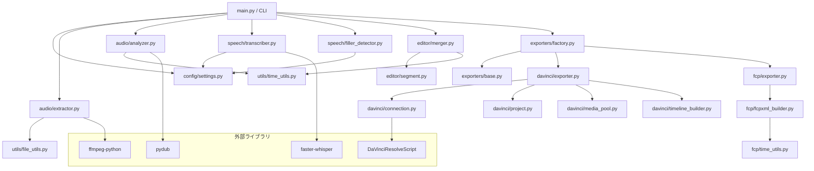
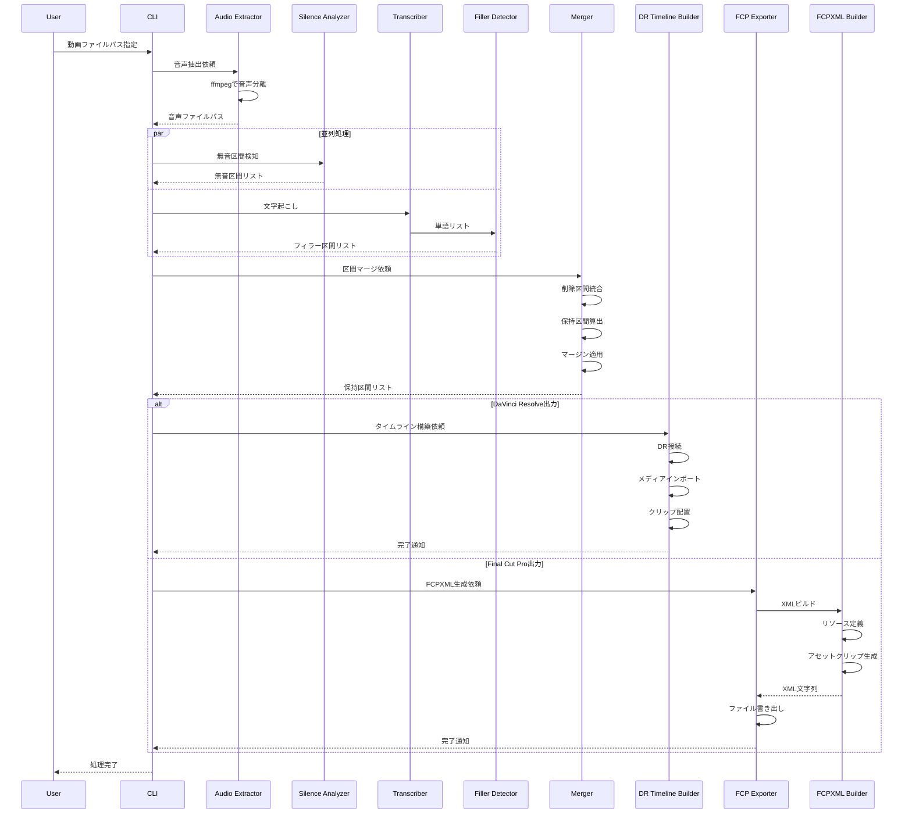
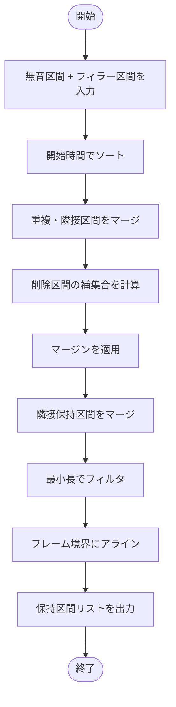

# システムアーキテクチャ設計書：DaVinci Resolve 自動編集エージェント

## 1. アーキテクチャ概要

本システムは、モジュール化されたPythonアプリケーションとして設計される。各機能は独立したモジュールとして実装し、疎結合な構成により拡張性と保守性を確保する。

### 1.1 設計原則
- **単一責任の原則**: 各モジュールは1つの責務のみを持つ
- **依存性逆転の原則**: 抽象に依存し、具象に依存しない
- **設定の外部化**: すべての可変パラメータは設定ファイルで管理

---

## 2. ディレクトリ構成

```
jetDR/
├── src/
│   ├── jetdr/
│   │   ├── __init__.py
│   │   ├── main.py              # エントリーポイント・CLI
│   │   ├── config/
│   │   │   ├── __init__.py
│   │   │   ├── settings.py      # 設定管理クラス
│   │   │   └── defaults.yaml    # デフォルト設定
│   │   ├── audio/
│   │   │   ├── __init__.py
│   │   │   ├── extractor.py     # 音声抽出
│   │   │   └── analyzer.py      # 無音検知
│   │   ├── speech/
│   │   │   ├── __init__.py
│   │   │   ├── transcriber.py   # 音声認識
│   │   │   └── filler_detector.py # フィラー検知
│   │   ├── editor/
│   │   │   ├── __init__.py
│   │   │   ├── segment.py       # 区間データモデル
│   │   │   └── merger.py        # 区間マージロジック
│   │   ├── davinci/
│   │   │   ├── __init__.py
│   │   │   ├── connection.py    # DR接続管理
│   │   │   ├── project.py       # プロジェクト操作
│   │   │   ├── media_pool.py    # メディアプール操作
│   │   │   ├── timeline_builder.py # タイムライン構築
│   │   │   └── exporter.py      # DaVinciExporter [NEW]
│   │   ├── exporters/           # [NEW] エクスポーター抽象化
│   │   │   ├── __init__.py      # 自動登録
│   │   │   ├── base.py          # 抽象基底クラス
│   │   │   └── factory.py       # ExporterRegistry
│   │   ├── fcp/                 # [NEW] Final Cut Pro対応
│   │   │   ├── __init__.py      # パッケージAPI
│   │   │   ├── time_utils.py    # フレーム精度時間計算
│   │   │   ├── fcpxml_builder.py # FCPXML生成
│   │   │   └── exporter.py      # FCPExporter
│   │   └── utils/
│   │       ├── __init__.py
│   │       ├── logger.py        # ログ設定
│   │       ├── time_utils.py    # 時間変換ユーティリティ
│   │       └── file_utils.py    # ファイル操作ユーティリティ
│   └── jetfcp/                  # [NEW] FCP専用CLI
│       ├── __init__.py
│       └── main.py              # export, analyze, validate
├── config/
│   ├── settings.yaml            # ユーザー設定
│   └── fillers.yaml             # フィラー辞書
├── tests/
│   ├── __init__.py
│   ├── conftest.py              # pytest設定
│   ├── test_segment.py          # Segmentテスト
│   ├── test_fcp/                # [NEW] FCPモジュールテスト
│   │   ├── __init__.py
│   │   ├── test_time_utils.py
│   │   └── test_exporter.py
│   ├── test_audio/
│   ├── test_speech/
│   ├── test_editor/
│   └── test_davinci/
├── docs/
│   └── davinci_resolve_auto_editor/
│       ├── requirements.md
│       ├── architecture.md
│       ├── implementation_plan.md
│       ├── task.md
│       └── api_reference.md
├── pyproject.toml
├── README.md
└── .gitignore
```

---

## 3. モジュール設計

### 3.1 コアモジュール依存関係図



---

## 4. データフロー

### 4.1 処理パイプライン



---

## 5. データモデル

### 5.1 区間データモデル (Segment)

```python
from dataclasses import dataclass
from enum import Enum
from typing import Optional

class SegmentType(Enum):
    """区間の種類"""
    SILENCE = "silence"      # 無音区間
    FILLER = "filler"        # フィラー区間
    KEEP = "keep"            # 保持区間
    CUT = "cut"              # 削除区間

@dataclass
class Segment:
    """時間区間を表すデータクラス"""
    start_ms: int            # 開始時間（ミリ秒）
    end_ms: int              # 終了時間（ミリ秒）
    type: SegmentType        # 区間の種類
    metadata: Optional[dict] = None  # 追加情報（検出単語など）
    
    @property
    def duration_ms(self) -> int:
        """区間の長さ（ミリ秒）"""
        return self.end_ms - self.start_ms
    
    def overlaps(self, other: 'Segment') -> bool:
        """他の区間と重複するかチェック"""
        return self.start_ms < other.end_ms and other.start_ms < self.end_ms
    
    def merge(self, other: 'Segment') -> 'Segment':
        """他の区間とマージ"""
        return Segment(
            start_ms=min(self.start_ms, other.start_ms),
            end_ms=max(self.end_ms, other.end_ms),
            type=self.type
        )
```

### 5.2 設定データモデル

```python
from pydantic import BaseModel
from typing import List

class SilenceDetectionConfig(BaseModel):
    """無音検知設定"""
    threshold_db: float = -40.0    # しきい値（dB）
    min_duration_ms: int = 300     # 最小無音期間（ms）

class FillerDetectionConfig(BaseModel):
    """フィラー検知設定"""
    model_name: str = "large-v3"   # Whisperモデル名
    language: str = "ja"           # 言語コード
    filler_words: List[str] = []   # フィラー単語リスト

class MarginConfig(BaseModel):
    """マージン設定"""
    before_ms: int = 100           # 開始前バッファ（ms）
    after_ms: int = 100            # 終了後バッファ（ms）

class AppConfig(BaseModel):
    """アプリケーション全体設定"""
    silence: SilenceDetectionConfig = SilenceDetectionConfig()
    filler: FillerDetectionConfig = FillerDetectionConfig()
    margin: MarginConfig = MarginConfig()
    fps: float = 29.97             # フレームレート
    output_format: str = "mov"     # 出力形式
```

---

## 6. インターフェース定義

### 6.1 音声抽出インターフェース

```python
from abc import ABC, abstractmethod
from pathlib import Path

class AudioExtractorInterface(ABC):
    """音声抽出の抽象インターフェース"""
    
    @abstractmethod
    def extract(self, video_path: Path, output_path: Path) -> Path:
        """
        動画から音声を抽出する
        
        Args:
            video_path: 入力動画ファイルパス
            output_path: 出力音声ファイルパス
            
        Returns:
            出力された音声ファイルのパス
        """
        pass
```

### 6.2 区間検知インターフェース

```python
from abc import ABC, abstractmethod
from typing import List
from pathlib import Path

class SegmentDetectorInterface(ABC):
    """区間検知の抽象インターフェース"""
    
    @abstractmethod
    def detect(self, audio_path: Path) -> List[Segment]:
        """
        音声ファイルから区間を検知する
        
        Args:
            audio_path: 音声ファイルパス
            
        Returns:
            検知された区間のリスト
        """
        pass
```

### 6.3 DaVinci Resolve連携インターフェース

```python
from abc import ABC, abstractmethod
from typing import List
from pathlib import Path

class DRControllerInterface(ABC):
    """DaVinci Resolve連携の抽象インターフェース"""
    
    @abstractmethod
    def connect(self) -> bool:
        """DRに接続"""
        pass
    
    @abstractmethod
    def create_timeline(
        self, 
        video_path: Path, 
        segments: List[Segment],
        timeline_name: str
    ) -> bool:
        """
        保持区間に基づいてタイムラインを作成
        
        Args:
            video_path: 元動画ファイルパス
            segments: 保持区間リスト
            timeline_name: タイムライン名
            
        Returns:
            成功したかどうか
        """
        pass
```

---

## 7. 保持区間算出アルゴリズム

### 7.1 アルゴリズムフローチャート



### 7.2 アルゴリズム詳細（擬似コード）

```python
def calculate_keep_segments(
    silence_segments: List[Segment],
    filler_segments: List[Segment],
    total_duration_ms: int,
    margin_before_ms: int = 100,
    margin_after_ms: int = 100,
    min_keep_duration_ms: int = 500,
    fps: float = 29.97
) -> List[Segment]:
    """
    保持すべき区間を計算する
    
    手順:
    1. 削除対象区間（無音 + フィラー）を統合
    2. 重複区間をマージ
    3. 削除区間の補集合として保持区間を算出
    4. マージンを適用
    5. 隣接した保持区間を結合
    6. 最小長でフィルタ
    7. フレーム境界にアライン
    """
    
    # Step 1: 削除対象区間を統合
    cut_segments = silence_segments + filler_segments
    
    # Step 2: 開始時間でソートしてマージ
    cut_segments.sort(key=lambda s: s.start_ms)
    merged_cuts = merge_overlapping_segments(cut_segments)
    
    # Step 3: 補集合として保持区間を算出
    keep_segments = []
    current_pos = 0
    
    for cut in merged_cuts:
        if current_pos < cut.start_ms:
            keep_segments.append(Segment(
                start_ms=current_pos,
                end_ms=cut.start_ms,
                type=SegmentType.KEEP
            ))
        current_pos = cut.end_ms
    
    # 最後の区間
    if current_pos < total_duration_ms:
        keep_segments.append(Segment(
            start_ms=current_pos,
            end_ms=total_duration_ms,
            type=SegmentType.KEEP
        ))
    
    # Step 4: マージン適用
    for seg in keep_segments:
        seg.start_ms = max(0, seg.start_ms - margin_before_ms)
        seg.end_ms = min(total_duration_ms, seg.end_ms + margin_after_ms)
    
    # Step 5: マージン適用後の重複をマージ
    keep_segments = merge_overlapping_segments(keep_segments)
    
    # Step 6: 最小長でフィルタ
    keep_segments = [
        s for s in keep_segments 
        if s.duration_ms >= min_keep_duration_ms
    ]
    
    # Step 7: フレーム境界にアライン
    frame_duration_ms = 1000 / fps
    for seg in keep_segments:
        seg.start_ms = align_to_frame(seg.start_ms, frame_duration_ms)
        seg.end_ms = align_to_frame(seg.end_ms, frame_duration_ms)
    
    return keep_segments
```

---

## 8. エラーハンドリング戦略

### 8.1 エラー分類

| カテゴリ         | 例                                   | 対応方針                     |
|------------------|--------------------------------------|------------------------------|
| ファイルエラー   | ファイルが見つからない、形式不正     | 明確なエラーメッセージで停止 |
| 音声処理エラー   | 音声抽出失敗、無音検知失敗           | リトライ後、スキップ         |
| 音声認識エラー   | モデルロード失敗、認識失敗           | フォールバックモードで継続   |
| DR接続エラー     | DRが起動していない、API接続失敗      | ユーザーに確認を促す         |
| DR操作エラー     | タイムライン作成失敗                 | ロールバック、再試行         |

### 8.2 例外クラス

```python
class JetDRError(Exception):
    """jetDRの基底例外クラス"""
    pass

class AudioExtractionError(JetDRError):
    """音声抽出エラー"""
    pass

class SilenceDetectionError(JetDRError):
    """無音検知エラー"""
    pass

class TranscriptionError(JetDRError):
    """文字起こしエラー"""
    pass

class DaVinciConnectionError(JetDRError):
    """DaVinci Resolve接続エラー"""
    pass

class TimelineCreationError(JetDRError):
    """タイムライン作成エラー"""
    pass
```

---

## 9. ログ設計

### 9.1 ログレベル定義

| レベル  | 用途                                           |
|---------|------------------------------------------------|
| DEBUG   | 詳細なデバッグ情報（開発時のみ）               |
| INFO    | 処理の進行状況、正常完了メッセージ             |
| WARNING | 継続可能だが注意が必要な状況                   |
| ERROR   | 処理失敗、エラー発生                           |

### 9.2 ログフォーマット

```python
from loguru import logger
import sys

# ログ設定
logger.remove()
logger.add(
    sys.stderr,
    format="<green>{time:YYYY-MM-DD HH:mm:ss}</green> | "
           "<level>{level: <8}</level> | "
           "<cyan>{name}</cyan>:<cyan>{function}</cyan>:<cyan>{line}</cyan> | "
           "<level>{message}</level>",
    level="INFO"
)
logger.add(
    "logs/jetdr_{time:YYYY-MM-DD}.log",
    rotation="1 day",
    retention="7 days",
    level="DEBUG"
)
```

---

## 10. テスト戦略

### 10.1 テストピラミッド

```
        /\
       /  \        E2Eテスト（DRとの統合）
      /    \       - 実際のDRと連携
     /------\
    /        \     統合テスト
   /          \    - モジュール間連携
  /------------\
 /              \  ユニットテスト
/                \ - 各関数・クラスの単体テスト
------------------
```

### 10.2 テストカバレッジ目標

| モジュール     | カバレッジ目標 |
|----------------|---------------|
| audio/         | 90%以上       |
| speech/        | 80%以上       |
| editor/        | 95%以上       |
| davinci/       | 70%以上       |
| utils/         | 95%以上       |

### 10.3 モック戦略

- DaVinci Resolve API: モッククラスで代替
- faster-whisper: 固定レスポンスを返すモック
- ffmpeg: サブプロセス呼び出しをモック
