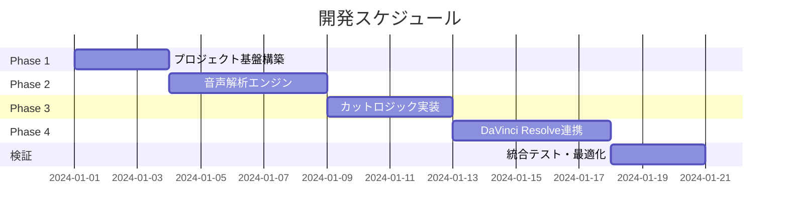

# 実装計画書：DaVinci Resolve 自動編集エージェント

## 目標

DaVinci Resolve Studioと連携し、動画内の無音区間およびフィラー（「あー」「えっと」等）を自動検知・削除してジェットカット済みタイムラインを生成するPythonアプリケーションを開発する。

---

## 開発フェーズ

本プロジェクトは4つのフェーズに分けて実装する。



---

## Phase 1: プロジェクト基盤構築（3日間）

### 1.1 プロジェクト初期化

#### [NEW] [pyproject.toml](file:///Users/atusi/repos/jetDR/pyproject.toml)
- プロジェクトメタデータの定義
- 依存ライブラリの指定
- 開発ツール設定（ruff, pytest, mypy）

```toml
[project]
name = "jetdr"
version = "0.1.0"
description = "DaVinci Resolve自動編集エージェント"
requires-python = ">=3.10"
dependencies = [
    "ffmpeg-python>=0.2.0",
    "pydub>=0.25.1",
    "faster-whisper>=1.0.0",
    "pyyaml>=6.0",
    "pydantic>=2.0",
    "loguru>=0.7.0",
    "typer>=0.9.0",
    "rich>=13.0.0",
]

[project.optional-dependencies]
dev = [
    "pytest>=7.4.0",
    "pytest-cov>=4.1.0",
    "ruff>=0.1.0",
    "mypy>=1.5.0",
]

[project.scripts]
jetdr = "jetdr.main:app"
```

---

#### [NEW] [src/jetdr/__init__.py](file:///Users/atusi/repos/jetDR/src/jetdr/__init__.py)
- パッケージ初期化
- バージョン情報

---

#### [NEW] [src/jetdr/main.py](file:///Users/atusi/repos/jetDR/src/jetdr/main.py)
- Typerを使用したCLIエントリーポイント
- 主要コマンド: `process`, `analyze`, `batch`

```python
import typer

app = typer.Typer(
    name="jetdr",
    help="DaVinci Resolve 自動編集エージェント"
)

@app.command()
def process(
    video_path: str,
    output_name: str = None,
    config_path: str = "config/settings.yaml"
):
    """単一動画を処理してタイムラインを生成"""
    ...

@app.command()
def analyze(video_path: str):
    """動画を解析して無音・フィラー区間を表示"""
    ...

@app.command()
def batch(folder_path: str):
    """フォルダ内の全動画を一括処理"""
    ...
```

---

### 1.2 設定管理

#### [NEW] [src/jetdr/config/settings.py](file:///Users/atusi/repos/jetDR/src/jetdr/config/settings.py)
- Pydanticベースの設定クラス
- YAML設定ファイルの読み込み

---

#### [NEW] [config/settings.yaml](file:///Users/atusi/repos/jetDR/config/settings.yaml)
- デフォルト設定値

```yaml
silence:
  threshold_db: -40.0
  min_duration_ms: 300

filler:
  model_name: "large-v3"
  language: "ja"

margin:
  before_ms: 100
  after_ms: 100

fps: 29.97
```

---

#### [NEW] [config/fillers.yaml](file:///Users/atusi/repos/jetDR/config/fillers.yaml)
- フィラー単語辞書

```yaml
fillers:
  - あー
  - えー
  - えっと
  - うーん
  - まあ
  - なんか
  - その
  - あのー
  - ええと
  - あのね
```

---

### 1.3 ユーティリティ

#### [NEW] [src/jetdr/utils/logger.py](file:///Users/atusi/repos/jetDR/src/jetdr/utils/logger.py)
- loguruを使用したログ設定
- ファイル/コンソール出力

---

#### [NEW] [src/jetdr/utils/time_utils.py](file:///Users/atusi/repos/jetDR/src/jetdr/utils/time_utils.py)
- ミリ秒⇔フレーム番号変換
- タイムコード変換

---

#### [NEW] [src/jetdr/utils/file_utils.py](file:///Users/atusi/repos/jetDR/src/jetdr/utils/file_utils.py)
- ファイル存在確認
- 一時ファイル管理

---

## Phase 2: 音声解析エンジン（5日間）

### 2.1 音声抽出

#### [NEW] [src/jetdr/audio/extractor.py](file:///Users/atusi/repos/jetDR/src/jetdr/audio/extractor.py)

**機能:**
- ffmpeg-pythonを使用して動画から音声をWAV形式で抽出

**実装内容:**
```python
class AudioExtractor:
    def __init__(self, sample_rate: int = 16000):
        self.sample_rate = sample_rate
    
    def extract(
        self, 
        video_path: Path, 
        output_path: Optional[Path] = None
    ) -> Path:
        """
        動画から音声を抽出
        
        Args:
            video_path: 入力動画ファイル
            output_path: 出力音声ファイル（省略時は一時ファイル）
            
        Returns:
            抽出された音声ファイルのパス
        """
        ...
```

---

### 2.2 無音検知

#### [NEW] [src/jetdr/audio/analyzer.py](file:///Users/atusi/repos/jetDR/src/jetdr/audio/analyzer.py)

**機能:**
- pydubを使用して音量ベースの無音区間を検出

**実装内容:**
```python
class SilenceAnalyzer:
    def __init__(
        self,
        threshold_db: float = -40.0,
        min_duration_ms: int = 300
    ):
        self.threshold_db = threshold_db
        self.min_duration_ms = min_duration_ms
    
    def detect_silence(self, audio_path: Path) -> List[Segment]:
        """
        音声ファイルから無音区間を検出
        
        Returns:
            無音区間のリスト
        """
        ...
```

---

### 2.3 音声認識・フィラー検知

#### [NEW] [src/jetdr/speech/transcriber.py](file:///Users/atusi/repos/jetDR/src/jetdr/speech/transcriber.py)

**機能:**
- faster-whisperを使用した音声認識
- 単語レベルのタイムスタンプ取得

**実装内容:**
```python
from faster_whisper import WhisperModel

class Transcriber:
    def __init__(
        self,
        model_name: str = "large-v3",
        device: str = "auto",
        compute_type: str = "auto"
    ):
        self.model = WhisperModel(
            model_name, 
            device=device, 
            compute_type=compute_type
        )
    
    def transcribe(
        self, 
        audio_path: Path
    ) -> List[WordTimestamp]:
        """
        音声を文字起こしし、単語タイムスタンプを取得
        
        Returns:
            単語とそのタイムスタンプのリスト
        """
        ...
```

---

#### [NEW] [src/jetdr/speech/filler_detector.py](file:///Users/atusi/repos/jetDR/src/jetdr/speech/filler_detector.py)

**機能:**
- 文字起こし結果からフィラー単語を検出
- カスタム辞書対応

**実装内容:**
```python
class FillerDetector:
    def __init__(self, filler_words: List[str]):
        self.filler_words = set(filler_words)
    
    def detect(
        self, 
        word_timestamps: List[WordTimestamp]
    ) -> List[Segment]:
        """
        単語リストからフィラー区間を検出
        
        Returns:
            フィラー区間のリスト
        """
        ...
```

---

## Phase 3: カットロジック実装（4日間）

### 3.1 データモデル

#### [NEW] [src/jetdr/editor/segment.py](file:///Users/atusi/repos/jetDR/src/jetdr/editor/segment.py)

**機能:**
- 区間データを表すデータクラス
- 区間操作ユーティリティ

---

### 3.2 区間マージロジック

#### [NEW] [src/jetdr/editor/merger.py](file:///Users/atusi/repos/jetDR/src/jetdr/editor/merger.py)

**機能:**
- 無音区間とフィラー区間の統合
- 重複区間のマージ
- 保持区間の算出
- マージン適用

**アルゴリズム:**
```
1. 無音区間 + フィラー区間 → 削除対象区間
2. 削除対象区間をソート・マージ
3. 補集合として保持区間を算出
4. マージンを適用
5. 隣接する保持区間を結合
6. 最小長でフィルタリング
7. フレーム境界にアライン
```

---

### 3.3 タイムライン生成

#### [NEW] [src/jetdr/editor/timeline.py](file:///Users/atusi/repos/jetDR/src/jetdr/editor/timeline.py)

**機能:**
- 保持区間リストからタイムラインデータを生成
- JSON形式でのエクスポート（デバッグ用）

---

## Phase 4: DaVinci Resolve連携（5日間）

### 4.1 接続管理

#### [NEW] [src/jetdr/davinci/connection.py](file:///Users/atusi/repos/jetDR/src/jetdr/davinci/connection.py)

**機能:**
- DaVinci Resolve Scripting APIへの接続
- 接続状態の管理

**実装内容:**
```python
class DRConnection:
    def __init__(self):
        self.resolve = None
        self.fusion = None
    
    def connect(self) -> bool:
        """DaVinci Resolveに接続"""
        ...
    
    def disconnect(self):
        """接続を解除"""
        ...
    
    @property
    def is_connected(self) -> bool:
        """接続状態を確認"""
        ...
```

---

### 4.2 プロジェクト操作

#### [NEW] [src/jetdr/davinci/project.py](file:///Users/atusi/repos/jetDR/src/jetdr/davinci/project.py)

**機能:**
- プロジェクトの作成・取得
- プロジェクト設定の管理

---

### 4.3 メディアプール操作

#### [NEW] [src/jetdr/davinci/media_pool.py](file:///Users/atusi/repos/jetDR/src/jetdr/davinci/media_pool.py)

**機能:**
- メディアのインポート
- ビン（フォルダ）管理

---

### 4.4 タイムライン構築

#### [NEW] [src/jetdr/davinci/timeline_builder.py](file:///Users/atusi/repos/jetDR/src/jetdr/davinci/timeline_builder.py)

**機能:**
- タイムラインの作成
- クリップの配置
- In/Outポイントの設定

**実装内容:**
```python
class TimelineBuilder:
    def __init__(self, connection: DRConnection):
        self.connection = connection
    
    def create_timeline(
        self,
        name: str,
        fps: float = 29.97
    ) -> Timeline:
        """新規タイムラインを作成"""
        ...
    
    def add_clips(
        self,
        timeline: Timeline,
        media_item: MediaPoolItem,
        segments: List[Segment]
    ) -> bool:
        """保持区間に基づいてクリップを配置"""
        ...
```

---

## 検証計画

### 自動テスト

```bash
# ユニットテスト実行
uv run pytest tests/ -v --cov=jetdr --cov-report=html

# 型チェック
uv run mypy src/jetdr/

# リンター
uv run ruff check src/jetdr/
```

### 統合テスト

| テストケース                  | 期待結果                           |
|-------------------------------|-----------------------------------|
| 10秒動画の無音検知            | 無音区間が正確に検出される         |
| 日本語音声のフィラー検知      | 「えー」「あー」が検出される       |
| 保持区間の算出                | マージン付きで正しく算出される     |
| DRタイムライン生成            | 指定区間のクリップが配置される     |
| バッチ処理                    | 複数ファイルが順次処理される       |

### 手動検証

1. **DaVinci Resolve連携**
   - DRを起動した状態でスクリプトを実行
   - タイムラインが正しく作成されることを確認
   - クリップのIn/Outポイントが正確であることを確認

2. **パフォーマンス検証**
   - 10分動画での処理時間を計測
   - GPU使用時と未使用時の比較

---

## リスクと対策

| リスク                        | 影響度 | 対策                                     |
|-------------------------------|--------|------------------------------------------|
| Whisperの認識精度が低い       | 中     | モデルサイズ調整、言語設定最適化         |
| DRのAPI仕様変更               | 高     | バージョン固定、互換層の実装             |
| 大容量動画でのメモリ不足      | 中     | チャンク処理、ストリーミング解析         |
| 無料版DRでの動作制限          | 高     | Studio版必須をドキュメントに明記         |
